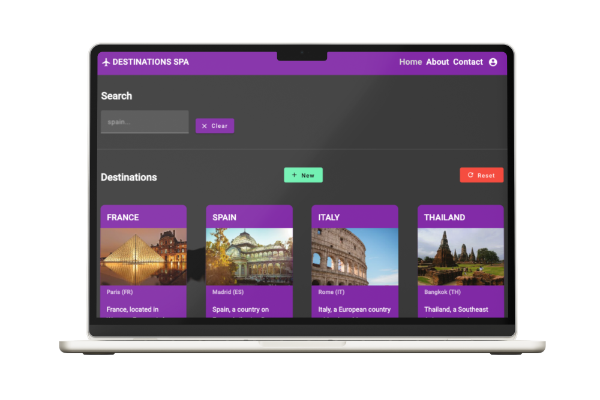

# Prueba técnica de angular


[](https://jgp84.github.io/destinations-spa/ "Go to my app in live")

**[Go to my app in live](https://jgp84.github.io/destinations-spa/)**

**Se ha decidido que la información que se consuma sea sobre destinos turísticos en lugar de héroes, para que esté más alineada con la empresa postulada.**

## Lista de Verificación de Requerimientos

### Configuración del Proyecto
- [x] Utilizar la última versión LTS de Angular, Typescript y de cualquier librería que se use en el proyecto.
- [x] La prueba se debe presentar en un repositorio de Git.

### Servicio
- [x] Crear un servicio que guarde la información de los destinos.
- [x] El servicio debe permitir:
  - [x] Consultar todos los destinos.
  - [x] Consultar un único destino por id.
  - [x] Consultar todos los destinos que contienen, en su nombre, el valor de un parámetro enviado en la petición.
  - [x] Modificar un destino.
  - [x] Eliminar un destino.
- [x] (Opcional) Test unitario del servicio.

### Componente
- [x] Crear un componente que utilice el servicio anterior.
- [x] El componente debe:
  - [x] Mostrar una lista paginada de destinos con botones de añadir, editar y borrar.
  - [x] Mostrar un input para filtrar por el destino seleccionado.
  - [x] Generar un formulario vacío al pulsar el botón de añadir.
  - [x] Generar un formulario con los datos del destino seleccionado al pulsar el botón de edición.
  - [x] Preguntar si se está seguro que se desea borrar el destino y, al confirmarlo, lo borrarlo.
- [x] (Opcional) Test unitario del componente.

### Consideraciones Adicionales
- [x] La información de destinos se guardará dentro del servicio.
- [x] Se valorarán las soluciones propuestas para cada punto, el modelo de datos y formato del código.

### Mejoras Opcionales
- [x] Utilizar Angular Material como apoyo visual.
- [x] Implementar rutas y navegación de la página.
- [x] Dockerizar la aplicación.
- [x] Implementar un interceptor para mostrar un elemento “loading” mientras se realiza alguna operación como “borrado” o “edición”.
- [x] Implementar una directiva para que al crear o editar en la caja de texto del nombre del destino, siempre se muestre en mayúscula.
- [x] Uso de mockserver para poder implementar las llamadas HTTP sin un backend.
- [x] Implementar comunicación entre componentes orientada a eventos.

### Valoración Positiva
- [x] La construcción del modelo de datos.
- [x] Uso de programación reactiva.
- [x] Código legible usando lambdas.

### Extras (No Requeridos)
- [x] Implementar local storage, para guardar y recuperar los datos de los formularios en caso de recarga del navegador.
- [x] Implementar un pipe personalizado, para truncar el número de caracteres que mostrará la tarjeta en la descripción.
- [x] Hacer la aplicación responsive para móviles.
- [x] Implementar animaciones, para estilizar las tarjetas y botones.
- [x] Desplegar la aplicación en Github Pages.

***

# Destinations SPA

This project was generated with [Angular CLI](https://github.com/angular/angular-cli) version 16.2.12.

## Development server

Run `ng serve` for a dev server. Navigate to `http://localhost:4200/`. The application will automatically reload if you change any of the source files.


## Build

Run `ng build` to build the project. The build artifacts will be stored in the `dist/` directory.

## Running unit tests

Run `ng test` to execute the unit tests via [Karma](https://karma-runner.github.io).

## Ejecutando la aplicación con Docker

Para ejecutar esta aplicación con Docker, sigue estos pasos:

1. **Construye la imagen de Docker**. En la raíz del proyecto, ejecuta el siguiente comando:

```bash
docker build -t nombre-de-tu-imagen .
```

Este comando construirá una imagen de Docker para tu aplicación utilizando el archivo `Dockerfile` en la raíz del proyecto. Puedes reemplazar `nombre-de-tu-imagen` con el nombre que quieras darle a tu imagen.

2. **Ejecuta el contenedor de Docker**. Una vez que la imagen se haya construido, puedes ejecutarla con el siguiente comando:

```bash
docker run -p 80:80 nombre-de-tu-imagen
```

Este comando ejecutará un contenedor de Docker basado en tu imagen. La opción `-p 80:80` mapea el puerto 80 del contenedor al puerto 80 de tu máquina local.

Ahora deberías poder acceder a tu aplicación en `http://localhost`.
